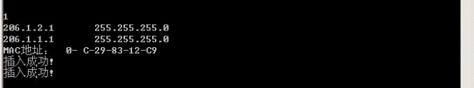

##实验5：简单路由器程序的设计
姓名：吴嘉诚

学号：2113879

专业：物联网工程


####一、实验内容及要求

（1）设计和实现一个路由器程序，要求完成的路由器程序能和现有的路由器产品（如思科路由器、华为路由器、微软的路由器等）进行协同工作。

（2）程序可以仅实现IP数据报的获取、选路、投递等路由器要求的基本功能。可以忽略分片处理、选项处理、动态路由表生成等功能。

（3）需要给出路由表的手工插入、删除方法。

（4）需要给出路由器的工作日志，显示数据报获取和转发过程。

（5）完成的程序须通过现场测试，并在班（或小组）中展示和报告自己的设计思路、开发和实现过程、测试方法和过程。

####二、实验环境配置

1.网络拓扑图

路由表

路由器1：206.1.3.0 255.255.255.0 206.1.2.2

路由器2：206.1.1.0 255.255.255.0 206.1.2.1

2.虚拟机配置

实验前需将四台虚拟机的网络调至仅主机模式，在3号虚拟机中手动添加路由表项 `route ADD 206.1.1.0 MASK255.255.255.0 206.1.2.`。并在2号虚拟机中运行路由器程序。

由于虚拟机VC++版本较低，在vs2022中需要依次点击 项目->属性->链接器->系统->所需最低版本，在所需最低版本里面填写5.01。在生成exe文件时需要选择x86，Release选项，开启多线程调试。

####三、实验设计

#####路由器具体工作流程
首先需要打开当前主机的网卡，获取IP地址和端口号。然后开始抓取数据包，过滤得到ARP数据包和ICMP数据包，由于此实验只是建立简单的通讯，所以只需要抓取ARP和ICMP报文。ARP数据包用于获取MAC地址，将获取的MAC地址存入ARP表。最后进行转发操作，将ICMP数据包转发给下一跳地址。

路由器设计共有三个线程：
1. 接收线程

此线程用于接收数据包并过滤出ARP和ICMP报文。

ARP报文处理：

（1）过滤不在同一网段下的ARP数据包。

（2）不转发跨网段的ARP请求数据包。

（3）将获取到的ARP数据包中的IP和MAC地址映射关系添加入ARP表中（数组）。

ICMP报文处理：

（1）过滤目的地址是本机的报文

（2）丢弃校验和错误的报文

（3）将需要转发的数据包存入缓冲区等待转发。


2. 转发线程
此线程主要处理需要转发的ICMP数据包。
（1）从缓冲区中找到并提取要转发的ICMP报文，检查各字段是否有误，如TTL为零等。

（2）判断目的IP是否与当前IP在同一网段下:

如果是同一网段，则查询ARP表项并获取目的MAC地址，将ICMP报文中的目的MAC地址替换为ARP表中的MAC地址，将TTL字段的值减一，重新计算校验和，转发此数据包。若在ARP缓存中未找到对应的MAC地址则进行ARP广播获取。

如果不是同一网段，则查找路由表项找到下一跳的IP地址，TTL字段减一，转发给下一跳的IP地址的路由器。

3. 路由表操作线程

考虑到在收发数据包时仍需要添加路由表项，所以要将路由表操作创建成一个线程。这样可以分离收发数据包和路由表项的创建删除查询，从而提高路由器的工作效率。
路由表采用链表的方式存储，查询时使用依次遍历的方式获取路由表项。

#####路由器程序设计
######1.打开网卡并获取IP地址和端口号
使用pcap_findalldevs函数打开网卡，获取网卡名称，IP地址，子网掩码，广播地址，端口信息等并存储IP地址和子网掩码。
```c
void get_my_IP() {
	int i = 0;
	pcap_addr_t* a;
	char errbuf[PCAP_ERRBUF_SIZE];
	if (pcap_findalldevs(&allDevices, errbuf) == -1)
	{
		printf("%s未找到设备：%s\n", stderr, errbuf);
	}
	for (currentDevice = allDevices; currentDevice; currentDevice = currentDevice->next)
	{
		printf("%d.%s\n", ++i, currentDevice->name);
		if (currentDevice->description)
			printf("(%s)\n", currentDevice->description);
		else
			printf("未找到IP\n");
		for (a = currentDevice->addresses; a != NULL; a = a->next) {
			if (a->addr->sa_family == AF_INET) {
				printf("\n================================================\n");
				char str[INET_ADDRSTRLEN];
				strcpy(str, inet_ntoa(((struct sockaddr_in*)a->addr)->sin_addr));
				printf("IP地址：%s\n", str);
				strcpy(str, inet_ntoa(((struct sockaddr_in*)a->netmask)->sin_addr));
				printf("子网掩码：%s\n", str);
				strcpy(str, inet_ntoa(((struct sockaddr_in*)a->broadaddr)->sin_addr));
				printf("广播地址：%s\n", str);

			}
		}
	}
	if (i == 0)
	{
		printf("Open Failed!\n");
	}
	currentDevice = allDevices;
	int j;
	printf("===============请选择需要打开的网卡序号================= \n\n");
	scanf("%d", &j);
	for (i = 0; i < j - 1; i++) {
		currentDevice = currentDevice->next;
	}
	int k = 0;
	for (a = currentDevice->addresses; a != NULL; a = a->next) {
		if (a->addr->sa_family == AF_INET) {
			strcpy(ip[k], inet_ntoa(((struct sockaddr_in*)a->addr)->sin_addr));
			strcpy(mask[k++], inet_ntoa(((struct sockaddr_in*)a->netmask)->sin_addr));

		}
	}
	targetDevice = pcap_open(currentDevice->name, 100, PCAP_OPENFLAG_PROMISCUOUS, 1000, NULL, errbuf);
	if (targetDevice == NULL) {
		printf("打开错误 %s \n", errbuf);

	}
	pcap_freealldevs(allDevices);
}
```
打开效果


######2.获取本机MAC地址
封装一个ARP包，向网络中广播获取本机的MAC地址并存储，这里的操作与实验三中相同，代码源自实验三。
```c
void get_my_Mac(DWORD ip) {
	memset(cur_mac, 0, sizeof(cur_mac));
	ARPFrame_t ARPFrame1;
	for (int i = 0; i < 6; i++) {
		ARPFrame1.FrameHeader.DesMAC[i] = 0xff;
		ARPFrame1.FrameHeader.SrcMAC[i] = 0x0f;
		ARPFrame1.SendHa[i] = 0x0f;
		ARPFrame1.RecvHa[i] = 0x00;
	}
	ARPFrame1.FrameHeader.FrameType = htons(0x0806);
	ARPFrame1.HardwareType = htons(0x0001);
	ARPFrame1.ProtocolType = htons(0x0800);
	ARPFrame1.HLen = 6;
	ARPFrame1.PLen = 4;
	ARPFrame1.Operation = htons(0x0001);
	ARPFrame1.SendIP = inet_addr("114.114.114.114");
	ARPFrame1.RecvIP = ip;
	struct pcap_pkthdr* pkt_header;
	const u_char* pkt_data;
	struct pcap_pkthdr* header = new pcap_pkthdr;
	int k;
	while ((k = pcap_next_ex(targetDevice, &pkt_header, &pkt_data)) >= 0) {
		pcap_sendpacket(targetDevice, (u_char*)&ARPFrame1, sizeof(ARPFrame_t));
		if (k == 0)
			continue;
		else if (*(unsigned short*)(pkt_data + 12) == htons(0x0806) && *(unsigned short*)(pkt_data + 20) == htons(0x0002) && *(unsigned long*)(pkt_data + 28) == ARPFrame1.RecvIP) {

			for (int i = 0; i < 6; i++) {
				cur_mac[i] = *(unsigned char*)(pkt_data + 22 + i);
			}
			break;
		}
	}
}
void get_mac_of(DWORD ip_)
{
	ARPFrame_t ARPFrame;
	//将目的MAC地址设置为广播地址
	for (int i = 0; i < 6; i++)
		ARPFrame.FrameHeader.DesMAC[i] = 0xff;
	//将源MAC地址设置为本机网卡的MAC地址
	for (int i = 0; i < 6; i++)
	{
		ARPFrame.FrameHeader.SrcMAC[i] = cur_mac[i];
		ARPFrame.SendHa[i] = cur_mac[i];
	}
	ARPFrame.FrameHeader.FrameType = htons(0x806);  //帧类型为ARP
	ARPFrame.HardwareType = htons(0x0001);          //硬件类型为以太网
	ARPFrame.ProtocolType = htons(0x0800);          //协议类型为IP
	ARPFrame.HLen = 6;                              //硬件地址长度为6
	ARPFrame.PLen = 4;                              //协议地址长为4
	ARPFrame.Operation = htons(0x0001);             //操作为ARP请求
	//当前主机打开网卡的IP地址
	ARPFrame.SendIP = inet_addr(ip[0]);

	for (int i = 0; i < 6; i++){
		ARPFrame.RecvHa[i] = 0;
	}
	ARPFrame.RecvIP = ip_;
	//发送ARP包
	pcap_sendpacket(targetDevice, (u_char*)&ARPFrame, sizeof(ARPFrame_t));
	//写入日志
	my_log.write_arp_log("发送", ARPFrame);
}
```

######3.接收线程
首先需要设置过滤器过滤IP和ARP包。对于ARP包的处理是判断是否有ARP缓存，若没有则添加，若有则不进行操作，直接丢弃。对于IP数据包，首先提取其包头，获取目的IP地址，判断是否需要转发，如果是ICMP错误报文，则不转发；如果ICMP报文均正确，转法前判断是否在同一网段下，若在，查询ARP表转发，若不在，查询路由表转发，并将TTL值减一。转发完需要在日志文件中添加日志。最后定时清除缓冲区中的信息，防止缓冲区溢出。
```c
DWORD WINAPI recv(LPVOID lparam) {
	RouteTable router_table = *(RouteTable*)(LPVOID)lparam;//从参数中获取路由表
	struct bpf_program fcode;
	//过滤IP和ARP包
	if (pcap_compile(targetDevice, &fcode, "ip or arp", 1, bpf_u_int32(mask[0])) < 0)
	{
		fprintf(stderr, "\n编译筛选器时出错：语法错误\n");
		system("pause");
		return -1;
	}

	//绑定过滤器
	if (pcap_setfilter(targetDevice, &fcode) < 0)
	{
		fprintf(stderr, "\n设置筛选器错误\n");
		system("pause");
		return -1;
	}
	while (1)
	{
		pcap_pkthdr* pkt_header;
		const u_char* pkt_data;
		while (1)
		{
			int ret = pcap_next_ex(targetDevice, &pkt_header, &pkt_data);
			if (ret)break;
		}
		FrameHeader_t* header = (FrameHeader_t*)pkt_data;//从帧首部获取目的MAC地址和帧类型
		if (Compare(header->DesMAC, cur_mac))            //处理目的MAC地址是本机的包
		{
			if (ntohs(header->FrameType) == 0x806)       //收到ARP数据报
			{
				ARPFrame_t* data = (ARPFrame_t*)pkt_data;//格式化收到的包为帧首部+ARP首部类型
				my_log.write_arpdata_log("[接收]", data);
				//收到ARP响应包
				if (data->Operation == ntohs(0x0002)) {
					BYTE tmp_mac[6];
					if (ip_mac_table->find(data->SendIP, tmp_mac));//该映射关系已经存到路由表中，不做处理

					else {
						DWORD tmp_ip;
						for (int i = 0; i < 6; i++) {
							tmp_mac[i] = data->SendHa[i];
						}
						tmp_ip = data->SendIP;
						ip_mac_table->insert(data->SendIP, data->SendHa);
					}
					//遍历缓冲区，看是否有可以转发的包
					for (int i = 0; i < packetnum; i++)
					{
						sndPkt_t packet = databuf[i];
						if (packet.flag == 0)
							continue;
						if (clock() - packet.t >= 6000) {//超时
							packet.flag = 0;
							continue;
						}
						if (packet.targetIP == data->SendIP)
						{
							IPFrame_t* IPf = (IPFrame_t*)packet.pktData;
							for (int i = 0; i < 6; i++) {
								IPf->FrameHeader.DesMAC[i] = data->SendHa[i];
							}

							for (int t = 0; t < 6; t++)
							{
								IPf->FrameHeader.SrcMAC[t] = cur_mac[t];
							}
							// 转发IP数据包
							pcap_sendpacket(targetDevice, (u_char*)packet.pktData, packet.len) != 0;
							databuf->flag = 0;
							my_log.write_ip_log("[转发]", (IPFrame_t*)packet.pktData);
						}
					}

				}
			}
			else if (ntohs(header->FrameType) == 0x800)//收到IP数据报
			{
				IPFrame_t* data = (IPFrame_t*)pkt_data;//帧首部+IP首部类型
				my_log.write_ip_log("[接收]", data);
				//获取目的IP地址，在路由表中查找下一跳ip地址
				DWORD dst_ip = data->IPHeader.DstIP;
				DWORD next_ip = router_table.find(dst_ip);

				// ICMP超时
				if (data->IPHeader.TTL <= 0)
				{
					ICMPPacketProc(11, 0, pkt_data);
					continue;
				}
				IPHeader_t* IpHeader = &(data->IPHeader);
				// 差错
				if (compare_checksum((char*)IpHeader) == 0)
				{
					my_log.write_ip_log("[校验和错误]", data);
					continue;
				}
				if (next_ip == -1)
				{
					ICMPPacketProc(3, 0, pkt_data);// ICMP目的不可达
					continue;
				}
				else
				{
					sndPkt_t packet;
					packet.targetIP = next_ip;

					for (int t = 0; t < 6; t++)
					{
						data->FrameHeader.SrcMAC[t] = cur_mac[t];
					}
					data->IPHeader.TTL -= 1;// 转发则TTL减1

					unsigned short check_buff[sizeof(IPHeader_t)];
					// 设IP头中的校验和为0
					data->IPHeader.Checksum = 0;

					memset(check_buff, 0, sizeof(IPHeader_t));
					IPHeader_t* ip_header = &(data->IPHeader);
					memcpy(check_buff, ip_header, sizeof(IPHeader_t));

					// 计算IP头部校验和
					data->IPHeader.Checksum = cal_checksum(check_buff, sizeof(IPHeader_t));

					// IP-MAC地址映射表中存在该映射关系
					if (ip_mac_table->find(packet.targetIP, data->FrameHeader.DesMAC))
					{
						memcpy(packet.pktData, pkt_data, pkt_header->len);
						packet.len = pkt_header->len;
						if (pcap_sendpacket(targetDevice, (u_char*)packet.pktData, packet.len) != 0)
						{
							// 错误处理
							continue;
						}
						my_log.write_ip_log("[转发]", (IPFrame_t*)packet.pktData);
					}
					// IP-MAC地址映射表中不存在该映射关系
					else
					{
						if (packetnum < 50)		
						{
							packet.len = pkt_header->len;
							// 将需要转发的数据报存入缓存区
							memcpy(packet.pktData, pkt_data, pkt_header->len);
							databuf[packetnum++] = packet;
							packet.t = clock();
							my_log.write_ip_log("[保存至缓冲区]", data);
							// 发送ARP请求
							get_mac_of(packet.targetIP);
						}
						else
						{
							my_log.write_ip_log("[缓冲区溢出]", data);
						}
					}
				}
			}
		}
	}
}
```

######4.ARP表操作
将ARP表封装成了一个类arptable，其中包含插入，查询操作。
存储ARP表使用的数据结构是数组，大小为50，存储形式大致为[IP地址1][MAC地址1][IP地址2][MAC地址2]。
查询采用直接遍历的方式，当找到对应的IP地址时，提取相应的MAC地址即可。
```c
class arptable {
public:
	DWORD ip;
	BYTE mac[6];
	static int num;

	static void insert(DWORD ip, BYTE mac[6]);
	static int find(DWORD ip, BYTE mac[6]);

}ip_mac_table[50];

int arptable::num = 0;

//arp表插入
void arptable::insert(DWORD ip, BYTE mac[6]) {
	ip_mac_table[num].ip = ip;
	memcpy(ip_mac_table[num].mac, mac, 6);
	num++;
}
//查找arp表
int arptable::find(DWORD ip, BYTE mac[6]) {
	memset(mac, 0, 6);
	for (int i = 0; i < num; i++)
	{
		if (ip == ip_mac_table[i].ip)
		{
			memcpy(mac, ip_mac_table[i].mac, 6);
			return 1;
		}
	}
	return 0;
}
```

######5.路由表操作
将路由表封装成了一个类RouteTable，其中包括路由表项的插入、删除、查询等操作。
创建路由表使用的数据结构是双向链表，链表插入时按照子网掩码降序排序，提前插入两个默认路由，并设置为不可删除。删除路由表项时通过索引查找到需要删除表项的前一项，找到后删除next即可。
当需要查询路由表时，使用IP地址和子网掩码找到对应的路由表项，返回对应的下一跳地址nextHop即可。
```c
class RouteTable {
public:
	route_entry* head, * tail;
	int count;
	RouteTable() {
		head = new route_entry;
		head->next = NULL;
		count = 0;
		for (int i = 0; i < 2; i++) {
			route_entry* r = new route_entry;
			r->dstNet = (inet_addr(ip[i])) & (inet_addr(mask[i]));
			r->netmask = inet_addr(mask[i]);
			r->type = 0;
			this->insert(r);
		}
	}
	void insert(route_entry* r) { //按照掩码降序排序
		route_entry* p;
		if (this->count == 0) {
			head->next = r;
			r->next = NULL;

		}
		else {
			p = head->next;
			while (p != NULL) {
				if (p->next == NULL || (r->netmask < p->netmask && r->netmask >= p->next->netmask)) {
					break;
				}
				p = p->next;
			}
			if (p->next == NULL) { //如果p找到了当前路由表的最后一项，即r的掩码最小，所以r成为路由表的最后一项
				r->next = NULL;
				p->next = r;

			}
			else { //插入在p后面
				r->next = p->next;
				p->next = r;

			}
		}
		p = head->next;
		for (int i = 0; p; i++) {
			p->index = i;
			p = p->next;
		}
		count++;
		printf("插入成功! \n");
	}
	void remove(int x) {//删除索引为x的表项
		for (route_entry* p = head; p; p = p->next) {
			if (x == 0) {
				if (head->type) {
					route_entry* q = head->next;
					head = q;
					head->next = q->next;
					count--;
					printf("删除成功!\n", x + 1);
					route_entry* temp = head->next;
					//更新索引
					for (int i = 0; temp; i++) {
						temp->index = i;
						temp = temp->next;
					}
					return;
				}
				else {
					printf("路径 %d 不可被删除!\n", x + 1);
					return;
				}
			}
			if (p->index == x - 1) { //找到了要删除的表项的前一个
				if (p->next->type) {
					route_entry* q = p->next;
					p->next = q->next;
					count--;
					printf("删除成功!\n", x + 1);
					route_entry* temp = head->next;
					//更新索引
					for (int i = 0; temp; i++) {
						temp->index = i;
						temp = temp->next;
					}
					return;
				}
				else {
					printf("删除失败（此路由不可被删除）!\n", x + 1);
					return;
				}
			}

		}
		printf("未找到路由!\n", x);
	}

	DWORD find(DWORD ip) { //根据给出查找路由表对应项，并返回nextHop
		route_entry* p = head;
		while (p) {
			if ((p->netmask & ip) == p->dstNet) {
				if (p->nextHop)
					return p->nextHop;
				else
					return ip;
			}
			p = p->next;
		}
		return -1;

	}
	void printTable() { //打印路由表
		route_entry* p = head->next;
		printf("======================Route Table========================\n");
		printf("index");
		printf("%*s", 19, "子网掩码");
		printf("%*s", 18, "目的IP");
		printf("%*s", 18, "下一跳");
		printf("%*s \n", 5, "type");
		while (p) {
			p->print();
			p = p->next;
		}
		printf("---------------------------------------------------------\n");

	}


};
```
插入、查询、删除


######6.路由日志
使用类my_log封装路由日志，其中包括IP报文、ICMP报文和ARP报文日志。
IP报文日志信息包括IP标志位信息（IP Packet-----），源IP（SrcIP），目的IP（DstIP），源MAC（SrcMAC），目的MAC（DstMAC）。
ARP报文日志包括MAC标志位信息（ARP Packet-----），IP地址和MAC地址。
ICMP报文日志就是ICMP报文标志位（ICMP Packet-----）+IP报文。
这些日志将存储在文件名为“router_log.txt”的文本文件中。
```c
class my_log {
public:
	my_log();
	~my_log();

	static FILE* fp;
	//写入日志 

	static void write_arp_log(const char* a, ARPFrame_t);//arp类型
	static void write_arpdata_log(const char* a, ARPFrame_t* pkt);//arp
	static void write_ip_log(const char* a, IPFrame_t*);//ip
	static void write_icmp_log(const char* a);//icmp
}my_log;

FILE* my_log::fp = nullptr;
my_log::my_log() {
	//指定文件名
	fp = fopen("router_log.txt", "a+");
}
my_log::~my_log() {
	fclose(fp);
}

//IP报文日志
void my_log::write_ip_log(const char* a, IPFrame_t* pkt) {
	fprintf(fp, a);
	fprintf(fp, "IP Packet-->");

	in_addr addr;
	addr.s_addr = pkt->IPHeader.SrcIP;
	char* str = inet_ntoa(addr);

	fprintf(fp, "SrcIP： ");
	fprintf(fp, "%s  ", str);
	fprintf(fp, "DstIP： ");
	addr.s_addr = pkt->IPHeader.DstIP;
	str = inet_ntoa(addr);
	fprintf(fp, "%s  ", str);
	fprintf(fp, "SrcMAC： ");
	for (int i = 0; i < 5; i++)
		fprintf(fp, "%02X-", pkt->FrameHeader.SrcMAC[i]);
	fprintf(fp, "%02X  ", pkt->FrameHeader.SrcMAC[5]);
	fprintf(fp, "DstMAC： ");
	for (int i = 0; i < 5; i++)
		fprintf(fp, "%02X-", pkt->FrameHeader.DesMAC[i]);
	fprintf(fp, "%02X\n", pkt->FrameHeader.DesMAC[5]);

}
//ARP报文日志
void my_log::write_arpdata_log(const char* a, ARPFrame_t* pkt) {	

	fprintf(fp, a);
	fprintf(fp, "ARP Packet-----");

	in_addr addr;
	addr.s_addr = pkt->SendIP;
	char* str = inet_ntoa(addr);
	fprintf(fp, "IP： ");
	fprintf(fp, "%s  ", str);

	fprintf(fp, "MAC： ");
	for (int i = 0; i < 5; i++)
		fprintf(fp, "%02X-", pkt->SendHa[i]);
	fprintf(fp, "%02X\n", pkt->SendHa[5]);

}
void my_log::write_arp_log(const char* a, ARPFrame_t pkt){	

	fprintf(fp, a);
	fprintf(fp, "ARP Packet-----");

	in_addr addr;
	addr.s_addr = pkt.SendIP;
	char* str = inet_ntoa(addr);
	fprintf(fp, "IP： ");
	fprintf(fp, "%s  ", str);

	fprintf(fp, "MAC： ");
	for (int i = 0; i < 5; i++)
		fprintf(fp, "%02X-", pkt.SendHa[i]);
	fprintf(fp, "%02X\n", pkt.SendHa[5]);

}
//ICMP报文日志
void my_log::write_icmp_log(const char* a) {		

	fprintf(fp, a);
}
```
日志展示


####四、实验结果
1.运行路由器程序，添加路由表项


2.在虚拟机1中使用ping命令测试连通性，可以发现虚拟机1和虚拟机4连接成功。


3.在四台虚拟机中打开wireshark抓包，可以看见ICMP数据包传输过程。


####五、实验问题及改进思路
1.查询ARP表优化

考虑到网络中设备增多的情况下，ARP表项的剧增，查询时如果使用依次遍历，时间复杂度将会很大，为了优化查询速率，可以使用二分查找算法使得时间复杂度从O（n）降为O（log n）。也可以使用哈希索引的方式查找IP和MAC地址的对应关系。

还可以将大规模的ARP表和路由表进行分片管理，可以降低每次查询的规模，提高查询效率。可以按照网络地址范围、子网等进行划分。

2.查询路由表优化

考虑到网络中设备增多的情况下，路由表项也会剧增，查询的时间变长，效率变低，可以考虑采用二叉搜索树的存储方式存储路由表项，这样查找时可以不用遍历所有子树即可找到对应的下一跳IP地址。

####六、实验思考与总结

这实验要求设计和实现一个路由器程序，使其能够协同工作于现有的路由器产品，包含IP数据报的获取、选路、投递等基本功能。尽管忽略了一些复杂的功能如分片处理和动态路由表生成，但在程序中需要手工插入、删除路由表，并记录工作日志以显示数据报的获取和转发过程。
在这个实验中，我们深入理解了路由器的基本原理和功能。通过手工插入、删除路由表的操作，更好地理解了路由表的维护和管理。编写工作日志使我们能够详细追踪程序运行的每个步骤，从而更好地理解数据报的处理流程。
在展示和报告的过程中，我们不仅向班级或小组呈现了我们的设计思路、开发和实现过程，还分享了我们在测试中遇到的挑战以及如何解决这些问题的方法。这使得整个团队都能够从彼此的经验中学到更多，并加深对网络路由器的理解。
总的来说，这个实验不仅锻炼了我们的编程技能，还加深了对网络通信和路由器工作原理的理解。同时，通过展示和报告，我们更好地培养了团队协作和沟通能力。


